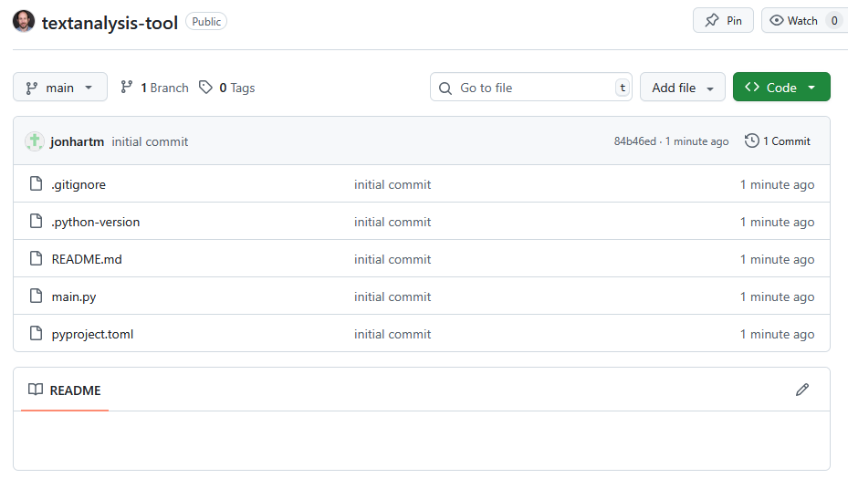

:::::::::::::::::::::::::::::::::::::: questions

- What is a Virtual Environment? / Why use a Virtual Environment?
- How do I create a Virtual Environment?

::::::::::::::::::::::::::::::::::::::::::::::::

::::::::::::::::::::::::::::::::::::: objectives

- Create a new virtual environment using `uv`
- Push our new project to a GitHub repository.

::::::::::::::::::::::::::::::::::::::::::::::::

## What is a Virtual Environment?

A virtual environment is an isolated workspace where you can install python packages and run python
code without worrying about affecting the tools, executables, and packages installed in either the
global python enviroment or in other projects.

::: callout

What is the difference between a "package manager" and a "virtual environment"?

A package manager helps automate the process of installing, upgrading, and removing software
packages. Each package is usually built on top of several other packages, and rely on the methods
and objects provided. However as projects are upgraded and changed over time, the available
methods and objects can change. A package manager solves the complex "dependncy web" created by
the packages you would like to install and finds the version of all required packages that meets
your needs.

:::

## Why Would I use a Virtual Environment?

If you are only ever working on your own projects, or on scripts for a single project, it's
absoultely fine to never worry about virtual environments. But as soon as you start creating
new projects working on code written by other people, it becomes incredibly important to know that
the code that you are running is running on the exact same versions of libraries.

In the past, it was notoriously difficult to manage envrironments with python:

[XKCD comic](https://xkcd.com/1987/)

There have been a number of attempts to create a "one size fits all" approach to virtual
environments and dependency management:

- venv
- virtualenv
- conda
- pipenv
- pyenv
- poetry

We're going to use [uv](https://docs.astral.sh/uv/) for the purposes of this workwhop. UV is a
another tool that promises to slot in to the needs of environment and dependency management,
however there are a few key elements that set it apart:

1. It is written in Rust, which gives it a significant speed improvement over pip and conda.
2. It works with the `pyproject.toml` and `uv.lock` files, which allow for human and computer
       readable project files.
3. It can install and manage it's own python versions.
4. It works as a drop-in replacement for pip, eliminating the need to learn new commands.

## Creating a project with UV

Before the workshop, you should have had a chance to install and check that your python and uv
executables were working. If you have not yet had a chance to do this, please refer to the
[setup]() page for this workshop.

We're going to start with a totally blank project, so let's create a directory called
"textanalysis-tool". Navigate to this directory in your command line. Let's quickly make sure we
have UV installed and working by typing `uv --version`. You should see something like the following
(the exact version number might be different):

{alt='Checking that
uv is installed by running "uv --version"'}

We can start off with a new project with UV by running the command `uv init`. This will
automatically create a couple files for us:

{alt='Files created by
running "uv init"'}

We can see that there are four files created by this command:

- `.python-version`: This file is used to optionally specify the Python version for the project.
- `main.py`: This is the main Python script for the project.
- `pyproject.toml`: This file is used to manage project dependencies and settings.
- `README.md`: This file contains human written information about the project.

If we take a look at the `pyproject.toml` file, we can see that it contains some basic information
about our project in a fairly readable format:

```toml
[project]
name = "textanalysis-tool-{my-name}"
version = "0.1.0"
description = "Add your description here"
readme = "README.md"
requires-python = ">=3.13"
dependencies = []
```

The `requires-python` field may vary depending on the exact version of python you're working with.

::: important

Make sure to change `{my-name}` in the `name` field to something unique, such as your GitHub
username. This is important later when we upload our package to TestPyPI, as package names must
be unique.

:::

## Creating a Virtual Environment

To create a virtual environment with UV, we can use the `uv venv` command. This will create a new
virtual environment in a directory called `.venv` within our project folder.

```bash
uv venv
```

Before we activate our environment, let's quickly check the location of the current python
executable you are using is by starting a python interpreter with the `python` keyword, and running
the following comands:

```python
import sys
sys.executable
```

You can type `exit` to leave the python interpreter

You should see the path to the location of the python executable on your machine. Now let's activate
our environment. The exact command will depend on your operating system, but if you look above the
python code to the output of the `uv venv` command, you should see the correct command.

```bash
source .venv/bin/activate
```

If this command works properly, you should see that before your prompt is now some text in
parenthesis:

```
(textanalysis-tool) D:\Documents\Projects\textanalysis-tool>
```

Let's start up the python interpreter again and check the location of our executable:

```python
import sys
sys.executable
```

What you should now see is that the executable is located in the .venv/Scripts directory of our
project:

```
(textanalysis-tool) D:\Documents\Projects\textanalysis-tool>python
Python 3.13.7 (tags/v3.13.7:bcee1c3, Aug 14 2025, 14:15:11) [MSC v.1944 64 bit (AMD64)] on win32
Type "help", "copyright", "credits" or "license" for more information.
>>> import sys
>>> sys.executable
'D:\\Documents\\Projects\\textanalysis-tool\\.venv\\Scripts\\python.exe'
```

Exit out of the interpreter and deactivate the virtual environment with `deactivate`.

## Git Commit and Pushing to our Repository

We also want to create another file called `.gitignore`, to control which files are added to our
git repository. It's generally a good idea to create this file early on, and update it whenever
you notice files or folders you want to explicitly prevent from being added to the repository.

We can create a gitignore from the command line with `type nul > .gitignore` (Windows),
or `touch .gitignore` (Mac/Linux). There are several pre-written gitignores that we can optionally
use, but for this project we'll maintain our own. Open up the file and add the following lines to
it:

```
__pycache__/
dist/
*.egg-info/
```

::: spoiler

A commonly used gitignore is the Python.gitignore maintained by GitHub. You can find it
[here](https://github.com/github/gitignore/blob/main/Python.gitignore).

:::

Next, let's set up a repository on GitHub to store our code. We'll make an entirely blank
repository, with the same name as our project: "textanalysis-tool".

{alt='The Github interface
for creating a new repository'}

::: callout

We're creating the files on our local machine first, then the remote repository. There's no reason
you can't go the other way around, creating the remote repository then cloning it to your local
machine.

:::

First, we'll initialize a git repository locally, making an intial commit with the files that uv
generated:

```
git init
git add .gitignore .python-version README.md main.py pyproject.toml
git commit -m "Initial commit"
```

Then we'll follow the directions for creating a new repository:

```
git remote add origin https://github.com/{username}/textanalysis-tool.git
git branch -M main
git push -u origin main
```

If all goes well, we'll see our code appear in the new repository:

{alt='The
Github interface showing the initial commit'}

And with that, we're ready to start writing our tool!

::: discussion

## Discussion Topic

TBD

:::

::::::::::::::::::::::::::::::::::::: keypoints

- Setting up a virtual environment is useful for managing project dependencies.
- Using `uv` simplifies the process of creating and managing virtual environments.
- There are several options other than `uv` for managing virtual environments, such as `venv` and
    `conda`.
- It's important to version control your project from the start, including a `.gitignore` file.

::::::::::::::::::::::::::::::::::::::::::::::::
