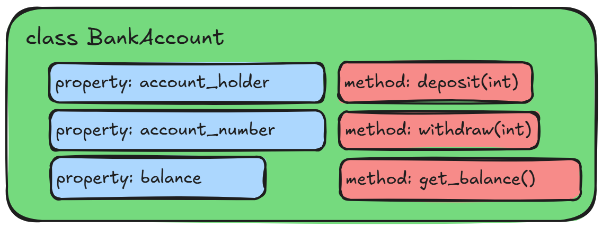
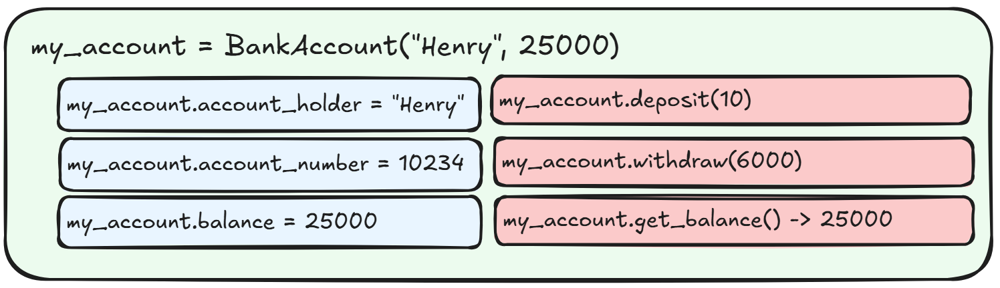

:::::::::::::::::::::::::::::::::::::: questions

- What is a class object?
- How can I define a class object in Python?
- How can I use a class object in my module?

::::::::::::::::::::::::::::::::::::::::::::::::

::::::::::::::::::::::::::::::::::::: objectives

- Create a Class object in our module.
- Demonstrate how to use our Class object in a sample script.

::::::::::::::::::::::::::::::::::::::::::::::::

## What is a Class Object?

You can think of a class object as a kind of "blueprint" for an object. It defines what properties
the object can have, and what methods it can perform. Once a class is defined, you can create any
number of objects based on that class, each of which is referred to as an "instance" of that class.

As an example, let's imagine a Bank Account. A Bank Account has many properties and can do many
things, but for our purposes, let's limit them slightly. Our Bank Account will have an account
holder and balance, and it will be able to deposit, withdraw, and check the balance.

The account holder and balance are all "properties" of the bank account. Depositing, withdrawing,
and checking the balance are all "methods" of the bank account. Here's a diagram of our bank
account object:

{alt='Bank Account Class object example'}

In python we can define a class object like this:

```python
class BankAccount:
    def __init__(self, account_holder, account_number, balance = 0.0):
        self.account_holder = account_holder
        self.account_number = account_number
        self.balance = balance

    def deposit(self, amount):
        if amount > 0:
            self.balance += amount
        else:
            raise ValueError("Deposit amount must be positive")

    def withdraw(self, amount):
        if amount > 0:
            if self.balance >= amount:
                self.balance -= amount
            else:
                raise ValueError("Insufficient funds")
        else:
            raise ValueError("Withdrawal amount must be positive")

    def get_balance(self):
        return self.balance
```

::: callout

The convention in python is that all classes should be named in CamelCase, with no underscores.
There are no limits enforced by the interpreter but it is good practice to follow the standards of
the python community.

:::

::: callout

The `get_balance` method is an example of a "getter" method, which simply exposes a property of the
class. In this case, it allows us to access the `balance` property of the class without directly
accessing the variable itself. This is a common pattern in object-oriented programming, and it can
be useful for a number of reasons, such as allowing us to add additional logic when accessing the
property (e.g. checking if the balance is negative before returning it), or allowing us to change
the internal representation of the property without affecting the external interface of the class.

Python has a special decorator called `@property` that allows us to define getter methods in a more
elegant way - we'll get to decorators in a later episode.

:::


Some of this might look familiar if you think about how we define functions in Python. There's a
`def` keyword, followed by the function name and parentheses. Inside the parentheses, we can define
parameters, and these parameters can contain default values. We can also include type hints, for
both parameters and return values. However all of this is indented one level, underneath the
`class` keyword, which is followed by our class name.

Note that this is just our blueprint - it doesn't refer to any specific bank account, just the
general idea of a bank account. Also note the `__init__` method. This is a special method which is
called whenever you "instantiate" a new object. The parameters for this function are supplied when
we first create an object and function similarly to a method, in that if no default value is
provided, it is required in order to create the object, and if a default value is provided, it is
optional.

An instance of a bank account, in this case called "my_account" might look something like this:

{alt='Bank Account Instance example'}

::: callout

What exactly is "an instance"?

An instance is how we refer to a specific object that has been created from a class. The class is
the "blueprint", while the instance is the actual object that is created based on that blueprint.

In our example, `my_account` is an instance of the `BankAccount` class. It has its own specific
values for the properties defined in the class (balance, account_holder), and it can use the
methods defined in the class (deposit, withdraw, get_balance).

:::

Also note that each of the methods within the class object definition starts with a "self"
argument. This is a reference to the current instance of the class, and is used to access
variables that belong to the class. In our example, we store the balance and account_holder as
properties of the class. When we call the `get_balance` method, we use `self.balance` to refer to
the current instance's balance property.

We can create a new instance of our `BankAccount` class like this:

```python
my_account = BankAccount(account_holder="Jimmy", account_number=12345, balance=100.0)
```

This sets the `account_holder` property to "Jimmy", the `account_number` property to 12345, and the
`balance` property to 100.0, but *only for this specific instance* of the `BankAccount` class. If we
create another instance, it will have its own `account_holder`, `account_number`, and `balance`
properties, which can be different from the first instance. We can check the properties of our
instance like this:

```python
print(my_account.account_holder)  # Output: Jimmy
print(my_account.account_number)  # Output: 12345
print(my_account.balance)         # Output: 100.0
```

We can create another instance of the `BankAccount` class:

```python
another_account = BankAccount(account_holder="Mike", account_number=67890, balance=2000.0)
print(another_account.account_holder)  # Output: Mike
print(another_account.account_number)  # Output: 67890
print(another_account.balance)         # Output: 2000.0
```

Modifying the properties of one instance does not affect the properties of another instance:

```python
my_account.balance += 50.0
print(my_account.balance)         # Output: 150.0
print(another_account.balance)  # Output: 2000.0
```

## A Class object for Our project

Let's create a class object for our vehicle module. Since we're going to create some useful objects
and methods for working with vehicles, let's define a `Car` class.

::: discussion

What properties and methods might we want to include in our Car class?

- Make / Model / Year
- Color
- Fuel
- Honk its horn
- Paint it a color
- Make engine noises

:::

Lets start writing our class object in a new file: `src/vehicle_module/car.py`:

```python
class Car:
    def __init__(self, make, model, year, color = "grey", fuel = "gasoline"):
        self.make = make
        self.model = model
        self.year = year
        self.color = color
        self.fuel = fuel
        self.speed = 0

    def honk_horn(self):
        return "Honk! Honk!"

    def paint(self, new_color):
        self.color = new_color

    def make_engine_noise(self):
        if self.speed <= 10:
            return "putt putt"
        else:
            return "vroom!"
```

Our class object `Car` is a "blueprint" for a collection of methods. When we define it, we need to
provide the required parameters for the `__init__` method, which are `make`, `model`, and `year`.
We can optionally provide `color` and `fuel`, which will default to "grey" and "gasoline" if we
don't provide them.

The `__init__` method is called as soon as the object is created, and we can see that in addition
to storing the parameters to their `self` counterparts, there is an additional property called
`self.speed`. This property is used to store the current speed of the car. It is referenced in the
`make_engine_noise` method, which returns a different string depending on the value of `self.speed`.

::: callout

## Principle of Least Astonishment (or, We're All Adults Here)

Unlike other programming languages, python doesn't have the concept of "private" or "internal"
variables and methods. Instead there is a convention which says that any variable or method that is
intended for internal use should be prefixed with an underscore (e.g. `content`). This is however
just a convention - there is nothing stopping you from accessing these variables and methods from
outside the class if you really want to.

:::

There are also three methods that we've defined - `honk_horn`, `paint`, and `make_engine_noise`.
None of these will be called directly on the class itself, but rather on instances of the class
that we create (as indicated by the use of `self` within the class methods). Note that the
`paint` and `make_engine_noise` methods reference the `self.color` and `self.speed` properties.
The `self` keyword refers to the specific *instance* of the class itself, and so it has access to
all of its properties and methods, including the `self.color` and `self.speed` properties.

## Trying out Our Class Object

Let's try out our new class object.
```

Next, let's create another test file. Our last one was called `vehicle_module_test.py`, so let's call this
`car_class_test.py`:

```python
import sys

sys.path.insert(0, "./src")

from vehicle_module.car import Car

total_tests = 3
passed_tests = 0
failed_tests = 0

# Check that we can create a Car object
car = Car(make="Toyota", model="Corolla", year=2020)
if car.make == "Toyota" and car.model == "Corolla" and car.year == 2020:
    passed_tests += 1
else:
    failed_tests += 1

# Test the methods
if car.honk_horn() == "Honk! Honk!":
    passed_tests += 1
else:
    failed_tests += 1

if car.make_engine_noise() == "putt putt":
    passed_tests += 1
else:
    failed_tests += 1

print(f"Total tests: {total_tests}")
print(f"Passed tests: {passed_tests}")
print(f"Failed tests: {failed_tests}")
```

Now we'll run this file using our uv environment:

```bash
uv run tests/car_class_test.py
```

You should see the output:

```
Total tests: 3
Passed tests: 3
Failed tests: 0
```

::::::::::::::::::::::::::::::::::::: challenge

## Challenge: What does this code do?

Take a look at the following code. Without running it yourself, what is the output of the final
line?

```python
class Cat:
    def __init__(self, name, age):
        self.name = name
        self.age = age
        self.is_sleeping = False

    def meow(self):
        if self.is_sleeping:
            return "Zzz..."
        else:
            return "Meow!"

    def sleep(self):
        self.is_sleeping = True

    def hear(self, sound):
        if sound == "food tin":
            self.is_sleeping = False
        else:
            self.is_sleeping = self.is_sleeping

my_cat = Cat(name="Squire Julian Gingivere", age=14)
my_cat.sleep()
my_cat.hear("psst psst psst!")
my_cat.sleep()
print(my_cat.meow())
my_cat.hear("food tin")
my_cat.hear("dinner time!")
print(my_cat.meow())
```

:::::::::::::::: solution

The output of the final line will be "Meow!". In order to know the output, we need to follow the
state of the instance variable `is_sleeping` throughout the code:

```python
my_cat = Cat(name="Squire Julian Gingivere", age=14)  # is_sleeping = False
my_cat.sleep()                                        # is_sleeping = True
my_cat.hear("psst psst psst!")                        # is_sleeping = True (no change)
my_cat.sleep()                                        # is_sleeping = True (no change)
print(my_cat.meow())                                  # Output: "Zzz..." (because is_sleeping == True - no effect on is_sleeping)
my_cat.hear("food tin")                               # is_sleeping = False (because sound == "food tin")
my_cat.hear("dinner time!")                           # is_sleeping = False (no change)
print(my_cat.meow())                                  # Output: "Meow!" (because is_sleeping == False)
```

:::::::::::::::::::::::::
:::::::::::::::::::::::::::::::::::::::::::::::

::::::::::::::::::::::::::::::::::::: challenge

## Challenge: Make a Class

Try your hand at creating your own class called "Dog". Try to write it such that the following code
will run with the following output:

```python
my_dog = Dog(name="Wally", breed="Mixed", age=12)
print(my_dog.name)
print(my_dog.make_sound())
print(my_dog.fetch())
```

Output:
```
Wally
Aroooo!
Yeah you can get the ball yourself.
```

:::::::::::::::: solution

```python
class Dog:
    def __init__(self, name, breed, age):
        self.name = name
        self.breed = breed
        self.age = age

    def make_sound(self):
        return "Aroooo!"

    def fetch(self):
        return "Yeah you can get the ball yourself."
```

:::::::::::::::::::::::::
:::::::::::::::::::::::::::::::::::::::::::::::

::::::::::::::::::::::::::::::::::::: challenge

## Challenge: Update the Dog Class

Edit the `Dog` class so that the `fetch` method accepts a parameter called `item` and returns a
string that says "Yeah you can get the {item} yourself." where `{item}` is replaced with the value
of the `item` parameter.

Example usage:

```python
my_dog = Dog(name="Wally", breed="Mixed", age=12)
print(my_dog.fetch("ball"))
print(my_dog.fetch("toy"))
```

Output:
```
Yeah you can get the ball yourself.
Yeah you can get the toy yourself.
```

Bonus: Add a parameter to the __init__ method called `favorite_toy` that defaults to "tennis ball".
Then, update the `fetch` method so that if the `item` parameter matches the `favorite_toy` property,
it returns "That's my favorite toy! I'll get it for you!" instead.

:::::::::::::::: solution

```python
class Dog:
    def __init__(self, name, breed, age):
        self.name = name
        self.breed = breed
        self.age = age

    def make_sound(self):
        return "Aroooo!"

    def fetch(self, item):
        return f"Yeah you can get the {item} yourself."
```

And for the bonus:

```python
class Dog:
    def __init__(self, name, breed = "Mixed", age = 0, favorite_toy = "tennis ball"):
        self.name = name
        self.breed = breed
        self.age = age
        self.favorite_toy = favorite_toy

    def make_sound(self):
        return "Aroooo!"

    def fetch(self, item):
        if item == self.favorite_toy:
            return "That's my favorite toy! I'll get it for you!"
        else:
            return f"Yeah you can get the {item} yourself."
```

:::::::::::::::::::::::::
:::::::::::::::::::::::::::::::::::::::::::::::

::::::::::::::::::::::::::::::::::::: challenge

## Challenge: Update the Dog Class Again

Update the constructor of the `Dog` class so that it has default values for the `breed` and `age`
parameters. The default value for `breed` should be "Mixed", and the default value for `age` should
be 0.

Running the following code should work without error and produce the following output:

```python
my_dog = Dog(name="Molly", breed="Black Labrador")
print(my_dog.name)
print(my_dog.breed)
print(my_dog.age)

my_other_dog = Dog(name="Buddy", age=5)
print(my_other_dog.name)
print(my_other_dog.breed)
print(my_other_dog.age)

my_neighbors_dog = Dog(name="Garth")
print(my_neighbors_dog.name)
print(my_neighbors_dog.breed)
print(my_neighbors_dog.age)
```

Output:
```
Molly
Black Labrador
0
Buddy
Mixed
5
Garth
Mixed
0
```

:::::::::::::::: solution

```python
class Dog:
    def __init__(self, name, breed = "Mixed", age = 0):
        self.name = name
        self.breed = breed
        self.age = age

    def make_sound(self):
        return "Aroooo!"

    def fetch(self, item):
        return f"Yeah you can get the {item} yourself."
```

As with writing python functions, we can provide default values for parameters for our class in the
`__init__` method. This allows us to create instances of the class without having to provide values
 for every parameter every time, which can be useful in many situations.

:::::::::::::::::::::::::
:::::::::::::::::::::::::::::::::::::::::::::::

::::::::::::::::::::::::::::::::::::: challenge

## Challenge: Validate the Dog Class

Add a check to ensure that:

- The `name` parameter is a string and is not an empty string.
- The `breed` parameter is a string and is not an empty string.
- The `age` parameter is an integer and is greater than or equal to 0.

If any of these checks fail, raise a `ValueError` with an appropriate error message.

You can include these checks either in the `__init__` method or in a separate validation method
that is called from the `__init__` method.

::: hint

You can use `isinstance()` to check the type of a variable.

:::

::: hint

You can use `raise ValueError("Your error message here")` to raise a ValueError with a custom error
message.

:::

:::::::::::::::: solution

```python
class Dog:
    def __init__(self, name, breed = "Mixed", age = 0):
        if not isinstance(name, str) or not name:
            raise ValueError("Name must be a non-empty string")
        if not isinstance(breed, str) or not breed:
            raise ValueError("Breed must be a non-empty string")
        if not isinstance(age, int) or age < 0:
            raise ValueError("Age must be an integer greater than or equal to 0")

        self.name = name
        self.breed = breed
        self.age = age

    def make_sound(self):
        return "Aroooo!"

    def fetch(self, item):
        return f"Yeah you can get the {item} yourself."
```

:::::::::::::::::::::::::
:::::::::::::::::::::::::::::::::::::::::::::::


::::::::::::::::::::::::::::::::::::: keypoints


- Python classes are defined using the `class` keyword, followed by the class name and a colon.
- The `__init__` method is a special method that is called when an instance of the class is created.
- Class methods are defined like normal functions, but they must include `self` as the first
    parameter.

:::::::::::::::::::::::::::::::::::::::::::::::
