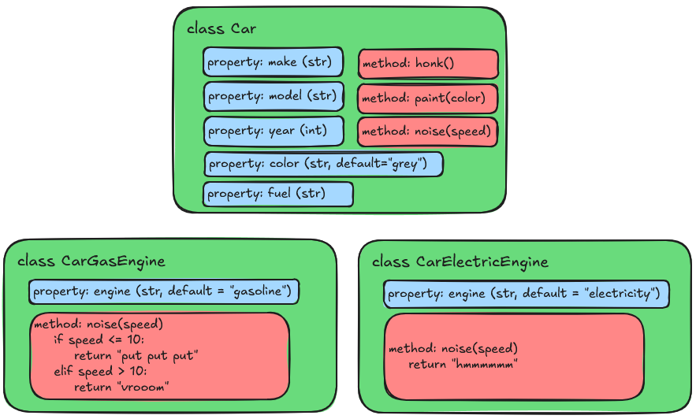

:::::::::::::::::::::::::::::::::::::: questions

- How does Composition differ from Inheritance?
- When should I use Composition over Inheritance?

::::::::::::::::::::::::::::::::::::::::::::::::

::::::::::::::::::::::::::::::::::::: objectives

- Explain the difference between Inheritance and Composition
- Use Composition to build classes that contain instances of other classes

::::::::::::::::::::::::::::::::::::::::::::::::

## Composition

In the previous episode, we saw how to use Inheritance to create a specialized version of an
existing class. But there's another strategy we can use to build classes: Composition. Composition
is a design principle where a class is composed of one or more objects from other classes, rather
than inheriting from them. This allows us to create complex functionality by combining several
smaller, simpler classes.

### Back to the Car Example

Let's revisit our `Car` example from the Class Objects episode. As a reminder, our class looked like
this:

{alt='Car Class object example'}

But what if we wanted to add more functionality to our `Car` class? For example, what if we wanted
to differentiate between cars that have different kinds of engines, like gasoline, or electric?
With the Inheritance approach, we would have to create a new subclass for each type of engine, like
this:

{alt='Car Inheritance example'}

The code might look something like this:

```python
class Car:
    def __init__(self, make: str, model: str, year: int, color: str = "grey", fuel: str = None):
        self.make = make
        self.model = model
        self.year = year
        self.color = color
        self.fuel = fuel

    def honk(self) -> str:
        return "beep"

    def paint(self, new_color: str) -> None:
        self.color = new_color

    def noise(self) -> str:
        raise NotImplementedError("Subclasses must implement this method")

class CarGasEngine(Car)
    def __init__(self, make: str, model: str, year: int, color: str = "grey"):
        super().__init__(make, model, year, color, fuel="gasoline")

    def noise(self, speed: int) -> str:
        if speed <= 10:
            return "put put put"
        elif speed > 10:
            return "vrooom"


class CarElectricEngine(Car)
    def __init__(self, make: str, model: str, year: int, color: str = "grey"):
        super().__init__(make, model, year, color, fuel="electric")

    def noise(self, speed: int) -> str:
        return "hmmmmmm"

```

But what happens if we start adding more kinds of engines? Or if our engines start getting more
complex, with different properties and methods? Even worse, what if we want to add a new type of
car component, like `Wheels`? Do we now need to start creating subclasses for every possible
combination of car, engine, and wheels? We would end up with a lot of subclasses, some of
which might have extremely similar (if not identical) functionality.

Instead, we can use a Compositional approach by making a new kind of class called `Engine`, and
then including an instance of that class as a property of the `Car` class. This way, we can create
different kinds of engines as separate classes, and then use them in our `Car` class without
having to create a new subclass for each one. Here's how that would look:

{alt='Car Composition example'}

```python
class Car:
    def __init__(self, make: str, model: str, year: int, color: str = "grey", engine: Engine = None):
        self.make = make
        self.model = model
        self.year = year
        self.color = color
        self.engine = engine

    def honk(self) -> str:
        return "beep"

    def paint(self, new_color: str) -> None:
        self.color = new_color

    def noise(self, speed: int) -> str:
        if self.engine:
            return self.engine.noise(speed)
        raise ValueError("Car must have an engine")


class Engine:
    def __init__(self, fuel: str):
        self.fuel = fuel

    def noise(self, speed: int) -> str:
        raise NotImplementedError("Subclasses must implement this method")

class GasEngine(Engine):
    def __init__(self):
        super().__init__(fuel="gasoline")

    def noise(self, speed: int) -> str:
        if speed <= 10:
            return "put put put"
        elif speed > 10:
            return "vrooom"

class ElectricEngine(Engine):
    def __init__(self):
        super().__init__(fuel="electric")

    def noise(self, speed: int) -> str:
        return "hmmmmmm"
```

At first glance this might look even more complicated, but it has several advantages:

- **Separation of Concerns**: The `Engine` class is responsible for engine-specific behavior, while
  the `Car` class focuses on car-specific behavior. This makes the code easier to understand and
  maintain.
- **Reusability**: The `Engine` class can be reused in other contexts, such as in a `Truck` or
    `Motorcycle` class, without duplicating code.
- **Flexibility**: We can easily add new types of engines by creating new subclasses of `Engine`,
    without having to modify the `Car` class or create new subclasses of `Car`.

## Refactoring our Document Example

Let's take this concept and apply it to our `Document` example from previous episodes. We can
create a new class called `Reader` that is responsible for reading files and providing the content
to the `Document` class. We can have a different reader type for each file format we want to
support.

To start with, let's create a directory for our readers called `readers`, and then create a base
class called `BaseReader` in a file called `readers/base_reader.py`:

```python
from abc import ABC, abstractmethod

class BaseReader(ABC):
    @abstractmethod
    def get_content(self, filepath: str) -> str:
        pass

    @abstractmethod
    def get_metadata(self, filepath: str) -> dict:
        pass
```

Then we'll create a `TextReader` class in a file called `readers/text_reader.py`. We'll move over
the logic for reading and extracting content from a Project Gutenberg text file here:

```python
import re

from readers.base_reader import BaseReader


class TextReader(BaseReader):
    TITLE_PATTERN = r"^Title:\s*(.*?)\s*$"
    AUTHOR_PATTERN = r"^Author:\s*(.*?)\s*$"
    ID_PATTERN = r"^Release date:\s*.*?\[eBook #(\d+)\]"
    CONTENT_PATTERN = r"\*\*\* START OF THE PROJECT GUTENBERG EBOOK .*? \*\*\*(.*?)\*\*\* END OF THE PROJECT GUTENBERG EBOOK .*? \*\*\*"

    def read(self, filepath: str) -> str:
        with open(filepath, encoding="utf-8") as file_obj:
            return file_obj.read()

    def _extract_metadata_element(self, pattern: str, text: str) -> str | None:
        match = re.search(pattern, text, re.MULTILINE)
        if match:
            return match.group(1).strip()
        return None

    def get_content(self, filepath: str) -> str:
        raw_text = self.read(filepath)
        match = re.search(self.CONTENT_PATTERN, raw_text, re.DOTALL)
        if match:
            return match.group(1).strip()
        raise ValueError(f"File {filepath} is not a valid Project Gutenberg Text file.")

    def get_metadata(self, filepath: str) -> dict:
        raw_text = self.read(filepath)

        title = self._extract_metadata_element(self.TITLE_PATTERN, raw_text)
        author = self._extract_metadata_element(self.AUTHOR_PATTERN, raw_text)
        extracted_id = self._extract_metadata_element(self.ID_PATTERN, raw_text)

        return {
            "title": title,
            "author": author,
            "id": int(extracted_id) if extracted_id else None,
        }
```

Next, we'll do the same for the HTML code. Create a file called `readers/html_reader.py`:

```python
import re

from bs4 import BeautifulSoup

from .base_reader import BaseReader


class HTMLReader(BaseReader):

    def read(self, filepath) -> BeautifulSoup:
        with open(filepath, encoding="utf-8") as file_obj:
            soup = BeautifulSoup(file_obj, features="html.parser")

        if not soup:
            raise ValueError("The file could not be parsed as HTML.")

        return soup

    def get_content(self, filepath) -> str:
        soup = self.read(filepath)

        # Find the first h1 tag (The book title)
        title_h1 = soup.find("h1")

        # Collect all the content after the first h1
        content = []
        for element in title_h1.find_next_siblings():
            text = element.get_text(strip=True)

            # Stop early if we hit this text, which indicate the end of the book
            if "END OF THE PROJECT GUTENBERG EBOOK" in text:
                break

            if text:
                content.append(text)

        return "\n\n".join(content)

    def get_metadata(self, filename) -> str:
        soup = self.read(filename)

        title = soup.find("meta", {"name": "dc.title"})["content"]
        author = soup.find("meta", {"name": "dc.creator"})["content"]
        url = soup.find("meta", {"name": "dcterms.source"})["content"]
        extracted_id = re.search(self.URL_PATTERN, url, re.DOTALL)
        id = int(extracted_id.group(1)) if extracted_id.group(1) else None

        return {"title": title, "author": author, "id": id}
```

Finally, we can update our `Document` class to use these readers. We'll add a new parameter to the
`Document` constructor called `reader`, which will be an instance of a `BaseReader` subclass.
Here's how the updated `Document` class might look:

```python
from textanalysis_tool.readers.base_reader import BaseReader

class Document:
    @property
    def gutenberg_url(self) -> str | None:
        if self.id:
            return f"https://www.gutenberg.org/cache/epub/{self.id}/pg{self.id}.txt"
        return None

    @property
    def line_count(self) -> int:
        return len(self.content.splitlines())

    def __init__(self, filepath: str, reader: BaseReader):
        self.filepath = filepath
        self.content = reader.get_content(filepath)

        metadata = reader.get_metadata(filepath)
        self.title = metadata.get("title")
        self.author = metadata.get("author")
        self.id = metadata.get("id")

    def get_word_occurrence(self, word: str) -> int:
        return self.content.lower().count(word.lower())
```

## Key Points

Ok, that's a lot of changes. So what was that all about?

- **Modularity**: Our code is now made up of smaller, more focused classes. The code responsible for
    reading files in and parsing the contents is separate from the code that represents a document
    and provides analysis.
- **Extensibility**: We can easily add support for new file formats by creating new reader classes
    that inherit from `BaseReader`, without having to modify the `Document` class.
- **Maintainability**: Each class has a single responsibility, making it easier to understand and
    maintain.
- **Reusability**: The reader classes can be reused in other contexts, such as in a different
    application that needs to read and parse files.

::: callout

Also note that in the `Document` class, in the `__init__` method, the typehint for the `reader`
parameter is `BaseReader`. This means that any subclass of `BaseReader` can be passed in, allowing
for flexibility in the type of reader used.

By using Inheritance and an abstract base class for the reader, we are essentially creating a
promise that any subclass of `BaseReader` will implement the methods defined in the base class. This
is how we can safely call `reader.get_content()` and `reader.get_metadata()` in the `Document`
class - we no longer care what specific type of reader it is, as long as it adheres to the
abstract base class interface.

:::

## Testing the New Objects

We can now delete our two inherited classes `DocumentText` and `DocumentHTML`, and update our tests
to use the new `TextReader` and `HTMLReader` classes. This, however means that we need to rewrite
our tests to use the new `Document` constructor, which requires a `BaseReader` subclass instance.

Because of our new Compositional design, we can now test the `Document` without a specific reader
by using a mock reader. This allows us to isolate the `Document` class and test its functionality
without relying on the actual file reading and parsing logic:

```python
import pytest

from textanalysis_tool.document import Document
from textanalysis_tool.readers.base_reader import BaseReader


class MockReader(BaseReader):
    def get_content(self, filepath: str) -> str:
        return "This is a test document. It contains words.\nIt is only a test document."

    def get_metadata(self, filepath: str) -> dict:
        return {
            "title": "Test Document",
            "author": "Test Author",
            "id": 1234,
        }


def test_create_document():
    doc = Document(filepath="dummy_path.txt", reader=MockReader())
    assert doc.title == "Test Document"
    assert doc.author == "Test Author"
    assert isinstance(doc.id, int) and doc.id == 1234


def test_line_count():
    doc = Document(filepath="dummy_path.txt", reader=MockReader())
    assert doc.line_count == 2


def test_get_word_occurrence():
    doc = Document(filepath="dummy_path.txt", reader=MockReader())
    assert doc.get_word_occurrence("test") == 2
```

::: callout

This time we are using a `MockReader` class that implements the `BaseReader` interface. We could
also use a fixture here, but this is simpler for demonstration purposes.

:::

::::::::::::::::::::::::::::::::::::: challenge

## Challenge 1: Writing Tests for the Readers

Now that we have our `TextReader` and `HTMLReader` classes, we need to write tests for them. Create
a new directory called `tests/readers`, and then create two new test files: `test_text_reader.py` and
`test_html_reader.py`. Write tests for the `get_content` and `get_metadata` methods of each reader
based on our previous tests for the `PlainTextDocument` and `HTMLDocument` classes.

:::::::::::::::: solution

`tests/readers/test_text_reader.py`

```python
import pytest
from unittest.mock import mock_open

from textanalysis_tool.readers.text_reader import TextReader

TEST_DATA = """
Title: Test Document

Author: Test Author

Release date: January 1, 2001 [eBook #1234]
                Most recently updated: February 2, 2002

*** START OF THE PROJECT GUTENBERG EBOOK TEST ***
This is a test document. It contains words.
It is only a test document.
*** END OF THE PROJECT GUTENBERG EBOOK TEST ***
"""


@pytest.fixture(autouse=True)
def mock_file(monkeypatch):
    mock = mock_open(read_data=TEST_DATA)
    monkeypatch.setattr("builtins.open", mock)
    return mock


def test_get_content():
    reader = TextReader()
    content = reader.get_content("dummy_path.txt")
    assert "This is a test document." in content
    assert "It is only a test document." in content


def test_get_metadata():
    reader = TextReader()
    metadata = reader.get_metadata("dummy_path.txt")
    assert metadata["title"] == "Test Document"
    assert metadata["author"] == "Test Author"
    assert metadata["id"] == 1234

```

`tests/readers/test_html_reader.py`

```python
import pytest
from unittest.mock import mock_open

from textanalysis_tool.readers.html_reader import HTMLReader

TEST_DATA = """
<head>
  <meta name="dc.title" content="Test Document">
  <meta name="dcterms.source" content="https://www.gutenberg.org/files/1234/1234-h/1234-h.htm">
  <meta name="dc.creator" content="Test Author">
</head>
<body>
  <h1>Test Document</h1>
  <p>
    This is a test document. It contains words.
    It is only a test document.
  </p>
</body>
"""


@pytest.fixture(autouse=True)
def mock_file(monkeypatch):
    mock = mock_open(read_data=TEST_DATA)
    monkeypatch.setattr("builtins.open", mock)
    return mock


def test_get_content():
    reader = HTMLReader()
    content = reader.get_content("dummy_path.html")
    assert "This is a test document." in content
    assert "It is only a test document." in content


def test_get_metadata():
    reader = HTMLReader()
    metadata = reader.get_metadata("dummy_path.html")
    assert metadata["title"] == "Test Document"
    assert metadata["author"] == "Test Author"
    assert metadata["id"] == 1234

```

:::::::::::::::::::::::::
:::::::::::::::::::::::::::::::::::::::::::::::

::::::::::::::::::::::::::::::::::::: challenge

## Challenge 2: Adding a New Reader

We have one last file type we haven't added support for yet: Epub. Create a new reader class for
epub files called `EpubReader` in a file called `readers/epub_reader.py`. You can use the
`ebooklib` package to read epub files. You can install it with pip:

```bash
uv pip install Ebooklib
```

You can refer to the [package documentation here](https://docs.sourcefabric.org/projects/ebooklib/en/latest/tutorial.html)

::: hint

To get the metadata from an epub file, you can use the `get_metadata` method of the `EpubBook`
class. Project Gutenberg uses the "Dublin Core" metadata standard, so the namespace is "DC".

Here's an example of how to get the title:

```python
book.get_metadata(namespace="DC", name="title")[0][0]
```

The `get_metadata` method returns a list of tuples, where the first element is the value and the
second element is the attributes, so we need to access the first element of the first tuple to get
the actual title.

The other metadata fields we need are "creator" (author) and "source" (id).

:::

::: hint

To get the content from an epub file, we can iterate over all of the "items" in the book that are
a document, then use `BeautifulSoup` to extract the text from the HTML content.

```python
for item in book.get_items_of_type(ebooklib.ITEM_DOCUMENT):
    soup = BeautifulSoup(item.get_content(), features="html.parser")
    text = soup.get_text()
    # Do something with the text
```

:::

:::::::::::::::: solution

```python
import re

from bs4 import BeautifulSoup
import ebooklib

from textanalysis_tool.readers.base_reader import BaseReader


class EPUBReader(BaseReader):
    SOURCE_URL_PATTERN = "https://www.gutenberg.org/files/([0-9]+)/[0-9]+-h/[0-9]+-h.htm"

    def read(self, filepath: str) -> ebooklib.epub.EpubBook:
        book = ebooklib.epub.read_epub(filepath)
        if not book:
            raise ValueError("The file could not be parsed as EPUB.")
        return book

    def get_content(self, filepath):
        book = self.read(filepath)
        text = ""
        for section in book.get_items_of_type(ebooklib.ITEM_DOCUMENT):
            content = section.get_content()
            soup = BeautifulSoup(content, features="html.parser")
            text += soup.get_text()
        return text

    def get_metadata(self, filepath) -> dict:
        book = self.read(filepath)

        source_url = book.get_metadata(namespace="DC", name="source")[0][0]
        extracted_id = re.search(self.SOURCE_URL_PATTERN, source_url, re.DOTALL).group(1)

        metadata = {
            "title": book.get_metadata(namespace="DC", name="title")[0][0],
            "author": book.get_metadata(namespace="DC", name="creator")[0][0],
            "extracted_id": int(extracted_id) if extracted_id else None,
        }
        return metadata
```

:::::::::::::::::::::::::
:::::::::::::::::::::::::::::::::::::::::::::::


::::::::::::::::::::::::::::::::::::: keypoints

- Composition allows us to build complex functionality by combining several smaller, simpler classes
- Composition promotes separation of concerns, reusability, flexibility, and maintainability
- By using abstract base classes, we can define interfaces that subclasses must implement, allowing for flexibility in our code design

::::::::::::::::::::::::::::::::::::::::::::::::

