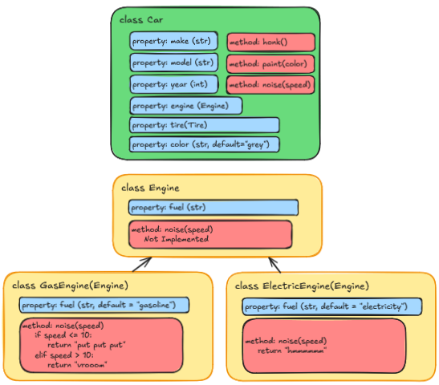
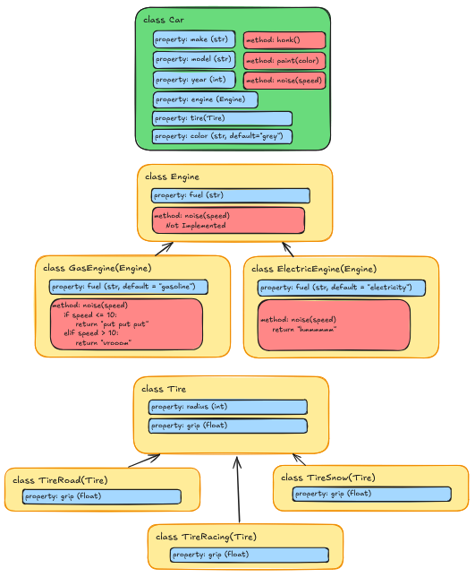

:::::::::::::::::::::::::::::::::::::: questions

- How does Composition differ from Inheritance?
- When should I use Composition over Inheritance?

::::::::::::::::::::::::::::::::::::::::::::::::

::::::::::::::::::::::::::::::::::::: objectives

- Explain the difference between Inheritance and Composition
- Use Composition to build classes that contain instances of other classes

::::::::::::::::::::::::::::::::::::::::::::::::

## Composition

In the previous episode, we saw how to use Inheritance to create a specialized version of an
existing class. But there's another strategy we can use to build classes: Composition. Composition
is a design principle where a class is composed of one or more objects from other classes, rather
than inheriting from them. This allows us to create complex functionality by combining several
smaller, simpler classes.

### Back to the Bank Account Example

Let's revisit our `BankAccount` example from the Class Objects episode. As a reminder, our class
looked like this:

{alt='BankAccount Class object example'}

But what if we wanted to add more functionality to our `BankAccount` class? We talked about in the
previous episode how we could use Inheritance to create specialized versions of the `BankAccount`
class, like this:

{alt='BankAccount Inheritance example'}

The code might look something like this:

```python
class BankAccount:
    # Static property to keep track of the next available account number
    next_account_number = 10000

    def __init__(self, account_holder, balance = 0.0, interest_calculator = None):
        self.account_holder = account_holder
        BankAccount.next_account_number += 1
        self.account_number = BankAccount.next_account_number
        self._balance = balance
    # ... the rest of the BankAccount class ...

class SavingsAccount(BankAccount):
    def __init__(self, account_holder, balance = 0.0, interest_rate = 0.01):
        super().__init__(account_holder=account_holder, balance=balance)
        self.interest_rate = interest_rate

    def apply_interest(self):
        self._balance += self._balance * self.interest_rate

class CheckingAccount(BankAccount):
    def __init__(self, account_holder, balance = 0.0, overdraft_limit = 500.0):
        super().__init__(account_holder=account_holder, balance=balance)
        self.overdraft_limit = overdraft_limit

    def withdraw(self, amount):
        if self._balance - amount < -self.overdraft_limit:
            raise ValueError("Withdrawal would exceed overdraft limit.")
        self._balance -= amount
```

But what happens if we start adding lots more kinds of accounts? Or if our accounts start getting
more complex, with different properties and methods? What if we have a `BusinessAccount` that has
different rules for interest and overdraft, or a `StudentAccount` that has different rules for fees?
We could start creating a whole hierarchy of classes, like
`BankAccount -> SavingsAccount -> BusinessSavingsAccount`, but this can quickly become unwieldy
and hard to maintain. This is where Composition comes in.

Instead, we can use a Compositional approach by making a new kind of class called
`InterestCalculator`, and then including an instance of that class as a property of the
`BankAccount` class. This way, we can create different kinds of interest calculators as separate
classes, and then use them in our `BankAccount` class without having to create a new subclass for
each one. Here's how that would look:

::: instructor
Need to remake this image
{alt='Car Composition example'}
:::

```python
class BankAccount:
    # Static property to keep track of the next available account number
    next_account_number = 10000

    def __init__(self, account_holder, balance = 0.0, interest_calculator = None):
        self.account_holder = account_holder
        BankAccount.next_account_number += 1
        self.account_number = BankAccount.next_account_number
        self._balance = balance
        self.interest_calculator = interest_calculator or InterestCalculator()

    def deposit(self, amount):
        if amount > 0:
            self.balance += amount
        else:
            raise ValueError("Deposit amount must be positive")

    def withdraw(self, amount):
        if amount > 0:
            if self.balance >= amount:
                self.balance -= amount
            else:
                raise ValueError("Insufficient funds")
        else:
            raise ValueError("Withdrawal amount must be positive")

    def get_balance(self):
        return self.balance

    def apply_interest(self): # This method is now a part of the BankAccount
        self.balance = self.interest_calculator.calculate_interest(self.balance)


class InterestCalculator:
    def __init__(self, interest_rate = 0.00):
        self.interest_rate = interest_rate

    def calculate_interest(self, balance):
        return balance + (balance * self.interest_rate)
```

At first glance this might look even more complicated, but it has several advantages:

- **Separation of Concerns**: The `InterestCalculator` class is responsible for interest-specific
  behavior, while the `BankAccount` class focuses on account-specific behavior. This makes the code
  easier to understand and maintain.
- **Reusability**: The `InterestCalculator` class can be reused in other contexts - we can create
  accounts that use different interest calculators without having to create new subclasses of
  `BankAccount`.
- **Flexibility**: We can easily add new types of interest calculators by creating new subclasses
  of `InterestCalculator`, without having to modify the `BankAccount` class or create new
  subclasses of `BankAccount`.

Think about if we wanted to add more functionality to our `BankAccount` class, like certain accounts
that might have different rules for overdraft, or have additional features, like fraud detection or
transaction history. We could create new classes for each of these features, and then include them
as properties of the `BankAccount` class, rather than creating a new subclass for each combination
of features:

```python

class BankAccount:
    next_account_number = 10000

    def __init__(
        self,
        account_holder,
        balance=0.0,
        interest_calculator=None,
        overdraft_protection=None,
        transaction_logger=None,
        fraud_detector=None,
    ):
        BankAccount.next_account_number += 1
        self.account_number = BankAccount.next_account_number
        self.account_holder = account_holder
        self._balance = balance
        self.interest_calculator = interest_calculator or InterestCalculator()
        self.overdraft_protection = overdraft_protection or OverdraftProtection()
        self.transaction_logger = transaction_logger or TransactionLogger()
        self.fraud_detector = fraud_detector or FraudDetector()

    # ... the rest of the BankAccount class ...

class InterestCalculator:
    def __init__(self, interest_rate = 0.00):
        self.interest_rate = interest_rate

    def calculate_interest(self, balance):
        return balance + (balance * self.interest_rate)

class OverdraftProtection:
    def __init__(self, limit=500.0):
        self.limit = limit

    def allows_withdrawal(self, balance, amount):
        return (balance - amount) >= -self.limit

class FraudDetector:
    def __init__(self, max_single_transaction=10_000.0):
        self.max_single_transaction = max_single_transaction

    def is_suspicious(self, amount):
        return amount > self.max_single_transaction

class TransactionLogger:
    def __init__(self, active=True):
        self.active = active
        self.history = []

    def log(self, action, amount):
        if self.active:
            self.history.append(f"{action}: ${amount:.2f}")
```

Then, when it comes time to create a new `BankAccount`, we can choose which features we want to
include and how they should behave, without having to create a new subclass for every combination
of features:

```python
basic_account = BankAccount(account_holder="Michael", balance=100.0)
savings_account = BankAccount(
    account_holder="Christian",
    balance=1000.0,
    interest_calculator=InterestCalculator(interest_rate=0.02),
)
premium_account = BankAccount(
    account_holder="Heath",
    balance=5000.0,
    interest_calculator=InterestCalculator(interest_rate=0.05),
    overdraft_protection=OverdraftProtection(limit=1000.0),
    transaction_logger=TransactionLogger(active=True),
    fraud_detector=FraudDetector(max_single_transaction=50_000.0),
)
```

This also makes it much easier to test our `BankAccount` class, since we can create mock versions
of the other classes and pass them in, allowing us to isolate the `BankAccount` class and test its
behavior without having to worry about how it interacts with the other classes. Likewise, this means
that we can isolate and test the behaviors of the other classes without having to worry about how
they interact with the `BankAccount` class.

Finally, this also helps with organizing code. Each class can be in its own file, and we can group
related classes together in a directory.

::: instructor
Need to remake this image
{alt='Complete Car Composition example'}
:::

## Refactoring our Car Example

Let's take this concept and apply it to our `Car` example from previous episodes. We can create a
new class called `Engine` that is responsible for handling the engine-specific noises, and then
include an instance of that as a property of the `Car` class. This way, we can create cars with
different kinds of engines without having to create a new subclass for each one;

To start with, let's create a directory for our engines called `src/vehicle_module/engines`, and
then create a base class called `BaseEngine` in a file called `engines/base_engine.py`. This will
be our "abstract base class" for all engines, and will define for us the exact methods that all
engines must implement:

```python
from abc import ABC, abstractmethod

class BaseEngine(ABC):
    def __init__(self, acceleration, top_speed, fuel_type):
        self.acceleration = acceleration
        self.top_speed = top_speed
        self.fuel_type = fuel_type

    @abstractmethod
    def make_engine_noise(self, rpm):
        pass
```

Next we'll make a pair of engine classes that inherit from `BaseEngine`, one for a `GasEngine` and
one for an `ElectricEngine`. We'll put these in files called `engines/gas_engine.py` and
`engines/electric_engine.py`, respectively:


`engines/gas_engine.py`
```python
from .base_engine import BaseEngine

class GasEngine(BaseEngine):
    def __init__(self, acceleration=20, top_speed=100, fuel_type="gasoline"):
        super().__init__(acceleration, top_speed, fuel_type)

    def make_engine_noise(self):
        return "putt putt"
```

`engines/electric_engine.py`
```python
from .base_engine import BaseEngine

class ElectricEngine(BaseEngine):
    def __init__(self, acceleration=50, top_speed=100, fuel_type="electric"):
        super().__init__(acceleration, top_speed, fuel_type)

    def make_engine_noise(self):
        return "hmmmmmm!"
```

Now, in our `Car` class, we can include an instance of `BaseEngine` as a property, and then use that
to make the engine noise:

```python
class Car(Vehicle):
    def __init__(self, make, model, year, color="grey", engine=None):
        super().__init__()
        self.make = make
        self.model = model
        self.year = year
        self.color = color
        self.engine = engine or GasEngine()
        self.handling = 2 # Add this in case you don't get through the challenges!

    def honk_horn(self):
        return "Honk! Honk!"

    def paint(self, new_color):
        self.color = new_color

    def make_engine_noise(self):
        return self.engine.make_engine_noise()

    def __str__(self):
        return f"A {self.color} {self.year} {self.make} {self.model} that runs on {self.engine.fuel_type}."

    @property
    def age(self):
        current_year = datetime.now().year
        return current_year - self.year

    @property
    def fuel(self):
        return self.engine.fuel_type

    @property
    def glyph_file(self):
        return "car.glyph"
```

Finally, we can remove the `GasolineCar` and `ElectricCar` classes from our `car.py` file - if we
want to create a gasoline car, we can just create a `Car` instance with a `GasEngine`, and if we
want to create an electric car, we can create a `Car` instance with an `ElectricEngine`


## Revising our Tests

Making this change means that our tests will need to be updated as well. To start with, we can
remove the tests for the `GasolineCar` and `ElectricCar` classes, since those classes no longer
exist.

### Mocking The Engine

Of the things we test in our `Car`, the two things that now rely on the engine are the
`make_engine_noise` method and the `fuel` property. We can easily test this by creating a mock
engine class just for our tests that looks exactly like an engine implementation, but returns
exactly the values we want to test:

```python
class MockEngine(BaseEngine):
    def __init__(self, acceleration=999, top_speed=9999, fuel_type="TEST FUEL"):
        super().__init__(acceleration, top_speed, fuel_type)

    def make_engine_noise(self):
        return "TEST NOISE"
```

This MockEngine class will slot into our Car class exactly like our real engines, but we can limit
the behavior to exactly what we want to test. This allows us to isolate the Car class and test its
behavior without having to worry about how it interacts with the engine classes.

```python
class MockEngine(BaseEngine):
    def __init__(self, acceleration=999, top_speed=9999, fuel_type="TEST FUEL"):
        super().__init__(acceleration, top_speed, fuel_type)

    def make_engine_noise(self):
        return "TEST NOISE"


@pytest.fixture
def my_car():
    return Car(make="Toyota", model="Corolla", year=2020, engine=MockEngine())


def test_car(my_car):
    assert my_car.make == "Toyota"
    assert my_car.model == "Corolla"
    assert my_car.year == 2020
    assert my_car.color == "grey"
    assert my_car.fuel == "TEST FUEL"


def test_car_noises(my_car):
    assert my_car.honk_horn() == "Honk! Honk!"
    assert my_car.make_engine_noise() == "TEST NOISE"
```

## Testing The Engines

Now, we can create a separate test file for our engines, testing the behavior of the `GasEngine`
and `ElectricEngine` classes without having to worry about how they interact with the `Car` class:

`tests/engines/test_gas_engine.py`
```python
from vehicle_module.engines.gas_engine import GasEngine


def test_gas_engine():
    engine = GasEngine(acceleration=30, top_speed=150, fuel_type="gasoline")
    assert engine.acceleration == 30
    assert engine.top_speed == 150
    assert engine.fuel_type == "gasoline"
    assert engine.make_engine_noise() == "putt putt"
```

`tests/engines/test_electric_engine.py`
```python
from vehicle_module.engines.electric_engine import ElectricEngine


def test_electric_engine():
    engine = ElectricEngine(acceleration=10, top_speed=120, fuel_type="electricity")
    assert engine.acceleration == 10
    assert engine.top_speed == 120
    assert engine.fuel_type == "electricity"
    assert engine.make_engine_noise() == "hmmmmmm!"

```

## Key Points

Ok, that's a lot of changes. So what was that all about?

- **Modularity**: Our code is now made up of smaller, more focused classes. The code responsible for
    doing engine things is separate from the code that represents a car.
- **Extensibility**: We can easily add support for new engine types by creating new engine classes
    that inherit from `BaseEngine`, without having to modify the `Car` class.
- **Maintainability**: Each class has a single responsibility, making it easier to understand and
    maintain.
- **Reusability**: The engine classes can be reused in other contexts, such as in a different
    application that needs to simulate vehicles.


::::::::::::::::::::::::::::::::::::: challenge

## Challenge 1: Writing a New Engine

We want to add two new engine types to our project: `DieselEngine` and `HybridEngine` that inherit
from `BaseEngine`. Write them so that the pass the following tests:

`src/vehicle_module/engines/diesel_engine.py`
```python
import pytest
from vehicle_module.engines.diesel_engine import DieselEngine

@pytest.fixture
def my_diesel_engine():
    return DieselEngine(acceleration=15, top_speed=80, fuel_type="diesel")

def test_diesel_engine(my_diesel_engine):
    assert my_diesel_engine.acceleration == 15
    assert my_diesel_engine.top_speed == 80
    assert my_diesel_engine.fuel_type == "diesel"
    assert my_diesel_engine.make_engine_noise() == "grrrrrr"
```

`src/vehicle_module/engines/hybrid_engine.py`
```python
import pytest
from vehicle_module.engines.hybrid_engine import HybridEngine


@pytest.fixture
def my_hybrid_engine():
    return HybridEngine(acceleration=20, top_speed=100, fuel_type="electric")


def test_hybrid_engine(my_hybrid_engine):
    assert my_hybrid_engine.acceleration == 20
    assert my_hybrid_engine.top_speed == 100
    assert my_hybrid_engine.fuel_type == "electric"
    assert my_hybrid_engine.make_engine_noise() == "hmmmmmm"


def test_hybrid_engine_switch_mode(my_hybrid_engine):
    assert my_hybrid_engine.fuel_type == "electric"
    my_hybrid_engine.switch_mode()
    assert my_hybrid_engine.fuel_type == "gasoline"


def test_hybrid_engine_mode_engine_noise(my_hybrid_engine):
    assert my_hybrid_engine.make_engine_noise() == "hmmmmmm"
    my_hybrid_engine.switch_mode()
    assert my_hybrid_engine.make_engine_noise() == "putt putt"

```

::: hint

For the `HybridEngine`, you will need to implement a method called `switch_mode` that changes the
`fuel_type` property from "electric" to "gasoline" and vice versa. The `make_engine_noise` method
will then need to return different values depending on the current `fuel_type`.

:::

:::::::::::::::: solution

`src/vehicle_module/engines/diesel_engine.py`
```python
from .base_engine import BaseEngine

class DieselEngine(BaseEngine):
    def __init__(self, acceleration=15, top_speed=80, fuel_type="diesel"):
        super().__init__(acceleration, top_speed, fuel_type)

    def make_engine_noise(self):
        return "grrrrrr"
```

`src/vehicle_module/engines/hybrid_engine.py`
```python
from .base_engine import BaseEngine


class HybridEngine(BaseEngine):
    def __init__(self, acceleration=5, top_speed=40, fuel_type="hybrid"):
        super().__init__(acceleration, top_speed, fuel_type)

    def make_engine_noise(self):
        if self.fuel_type == "electric":
            return "hmmmmmm"
        else:
            return "putt putt"

    def switch_mode(self):
        if self.fuel_type == "electric":
            self.fuel_type = "gasoline"
        else:
            self.fuel_type = "electric"

```

:::::::::::::::::::::::::
:::::::::::::::::::::::::::::::::::::::::::::::

::::::::::::::::::::::::::::::::::::: challenge

## Challenge 2: Creating a New Car Component

In addition to engines, we want to add a new component to our `Car` class: a `Wheel` class that
represents the wheels of the car.

1. Create a new abstract base class called `BaseWheel` that defines the interface for all wheels. It should have the following properties and methods:
   - `pressure`: The air pressure in the wheels (in BAR)
   - `material`: The material of the wheel (e.g., rubber, alloy)
2. The `BaseWheel` class should implement the following method:

```python
    def get_handling_score(self):
        # Ideal pressure is 2.3 BAR, so the score is based off of how far the current pressure is from 2.3.
        pressure_score = abs(self.pressure - 2.3) / 2.3

        # The handling score is a 50/50 mix of the pressure score and tread depth.
        handling = (1 - pressure_score) * 0.5 + (self.tread / 10) * 0.5

        # Ensure that handling is between 0 and 3
        handling = min(3, round(handling * 3))

        return handling
```

3. Create two subclasses of `BaseWheel`: `RacingWheel` and `OffRoadWheel`. You can set the default
  values for pressure and tread in the constructors of these classes.
4. Create a test file for `src/vehicle_module/wheels` that tests the behavior of the `BaseWheel`.
  Ensure that "pressure" is a positive floating point number, and that tread is an integer between
  0 and 10, and that it raises a ValueError if the values are incorrect.
5. Add tests for `get_handling_score` to ensure that it always returns a value between 0 and 3.

:::::::::::::::: solution

`src/vehicle_module/wheels/base_wheel.py`
```python
from abc import ABC, abstractmethod


class BaseWheels(ABC):
    def __init__(self, pressure, tread):
        if not isinstance(pressure, (int, float)) or pressure <= 0:
            raise ValueError("Tire pressure must be a positive number.")

        if not isinstance(tread, int) or not (1 <= tread <= 10):
            raise ValueError("Tread must be an integer between 1 and 10.")

        self.pressure = pressure
        self.tread = tread

    def get_handling_score(self):
        # Ideal pressure is 2.3 BAR, so the score is based off of how far the current pressure is from 2.3.
        pressure_score = abs(self.pressure - 2.3) / 2.3

        # The handling score is a 50/50 mix of the pressure score and tread depth.
        handling = (1 - pressure_score) * 0.5 + (self.tread / 10) * 0.5

        # Ensure that handling is between 0 and 3
        handling = min(3, round(handling * 3))

        return handling

```

`src/vehicle_module/wheels/racing_wheel.py`
```python
from .base_wheel import BaseWheels

class RacingWheel(BaseWheels):
    def __init__(self, pressure=2.5, tread=8):
        super().__init__(pressure, tread)
```

`src/vehicle_module/wheels/off_road_wheel.py`
```python
from .base_wheel import BaseWheels

class OffRoadWheel(BaseWheels):
    def __init__(self, pressure=2.0, tread=10):
        super().__init__(pressure, tread)
```

`tests/wheels/test_base_wheel.py`
```python
import pytest

from vehicle_module.wheels.base_wheel import BaseWheels

def test_base_wheel_valid_initialization():
    wheel = BaseWheels(pressure=2.5, tread=8)
    assert wheel.pressure == 2.5
    assert wheel.tread == 8

def test_base_wheel_invalid_pressure():
    with pytest.raises(ValueError):
        BaseWheels(pressure=-1, tread=5)

    with pytest.raises(ValueError):
        BaseWheels(pressure=0, tread=5)

    with pytest.raises(ValueError):
        BaseWheels(pressure="high", tread=5)

def test_base_wheel_invalid_tread():
    with pytest.raises(ValueError):
        BaseWheels(pressure=2.5, tread=0)

    with pytest.raises(ValueError):
        BaseWheels(pressure=2.5, tread=11)

    with pytest.raises(ValueError):
        BaseWheels(pressure=2.5, tread="deep")

def test_get_handling_score():
    wheel = BaseWheels(pressure=2.3, tread=10)
    assert 0 <= wheel.get_handling_score() <= 3

    wheel = BaseWheels(pressure=1.0, tread=5)
    assert 0 <= wheel.get_handling_score() <= 3

    wheel = BaseWheels(pressure=3.0, tread=1)
    assert 0 <= wheel.get_handling_score() <= 3
```

:::::::::::::::::::::::::
:::::::::::::::::::::::::::::::::::::::::::::::


::::::::::::::::::::::::::::::::::::: keypoints

- Composition allows us to build complex functionality by combining several smaller, simpler classes
- Composition promotes separation of concerns, reusability, flexibility, and maintainability
- By using abstract base classes, we can define interfaces that subclasses must implement, allowing for flexibility in our code design

::::::::::::::::::::::::::::::::::::::::::::::::

