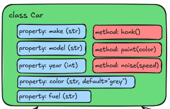
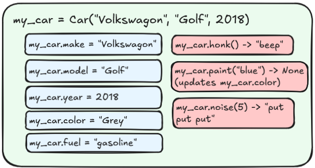

:::::::::::::::::::::::::::::::::::::: questions

- What is a class object?
- How can I defined a class object in Python?
- How can I use a class object in my module?

::::::::::::::::::::::::::::::::::::::::::::::::

::::::::::::::::::::::::::::::::::::: objectives

- Create a Class object in our module.
- Demonstrate how to use our Class object in a sample script.

::::::::::::::::::::::::::::::::::::::::::::::::

## What is a Class Object?

You can think of a class object as a kind of "blueprint" for an object. It defines what properties
the object can have, and what methods it can perform. Once a class is defined, you can create any
number of objects based on that class, each of which is referred to as an "instance" of that class.

As an example, let's imagine a Car. A Car has many properties and can do many things, but for our
purposes, let's limit them slightly. Our Car will have a make, model, year, and color, and it will
be able to honk, and be painted.

The make, model, year, and color are all "properties" of the car. Honking a horn and being painted
are both "methods" of the car. Here's a diagram of our car object:

{alt='Car Class object example'}

In python we can define a class object like this:

```
class Car:
    def __init__(self, make: str, model: str, year: int, color: str = "grey"):
        self.make = make
        self.model = model
        self.year = year
        self.color = color

    def honk(self) -> str:
        return "beep"

    def paint(self, new_color: str) -> None:
        self.color = new_color
```

::: callout

The convention in python is that all classes should be named in CamelCase, with no underscores.
Class names in reality can be anything you like, but this is the standard in the python community.

:::

Note that this is just our blueprint - it doesn't refer to any specific car, just the general idea
of a car. Also note the `__init__` method. This is a special method which is called whenever you
"instantiate" a new object. The parameters for this function are supplied when we first create an
object and function similarly to a method, in that if no default value is provided, it is required
in order to create the object, and if a default value is provided, it is optional.

An instance of a car, in this case called "my_car" might look something like this:

{alt='Car Instance example'}

Also note that each of the methods within the class object definition starts with a "self"
argument. This is a reference to the current instance of the class, and is used to access
variables that belong to the class. In our example, we store the make, model, year and color as
properties of the class. When we call the `paint` method, we use `self.color` to refer to the
current instance's color property.

::: callout

The `__init__` method is called a "dunder" (double underlined) method in python. There are a number
of other dunder methods that we can define, that will interact with various built-in functions and
operators. For example, we can define a `__str__` method, that will allow us to specify how our
object should be represented as a string when we call `str()` on it. Likewise, we can define
`__eq__`, which would tell python how to behave when we compare two objects for equality.

:::

## A Class object for Our project

Let's create a class object for our text analysis project. We're going to be downloading some books
from [Project Gutenberg](https://www.gutenberg.org/). To make things easy to begin with, we'll
limit ourselves to just the .txt files.

Since we're going to create some useful objects and methods for working with documents, let's
define a `Document` class.

::: discussion

Take a look a an example txt document from Project Gutenberg:
[Meditations, by Marcus Aurelius](https://www.gutenberg.org/cache/epub/2680/pg2680.txt)

What properties and methods might we want to include in our Document class?

:::

It looks like there's a standard metadata section in these documents, with a Title, Author, Release
Date, Language, and Credits. Those will probably be useful metadata. Looking at the url for this
file, it also looks like there's an ID on Project Gutenberg.

For methods, we'll need to be able to read the document from a file. And for some simple methods,
let's count the number of lines in a document, and another method to get the number of times a
particular word appears.

Lets start writing our class object in a new file: `src/textanalysis_tool/document.py`:

```python

class Document:
    def __init__(self, filepath: str, title: str, author: str, id: int):
        self.filepath = filepath
        self.title = title
        self.author = author
        self.id = id
        self._content = self._read(self.filepath)

    def _read(self, file_path: str) -> None:
        with open(file_path, 'r', encoding='utf-8') as file:
            return file.read()

    def get_line_count(self) -> int:
        return self._content.count('\n')

    def get_word_occurance(self, word: str) -> int:
        return self._content.lower().count(word.lower())
```

::::::::::::::::::::::::::::::::::::: keypoints

- foo

::::::::::::::::::::::::::::::::::::::::::::::::

