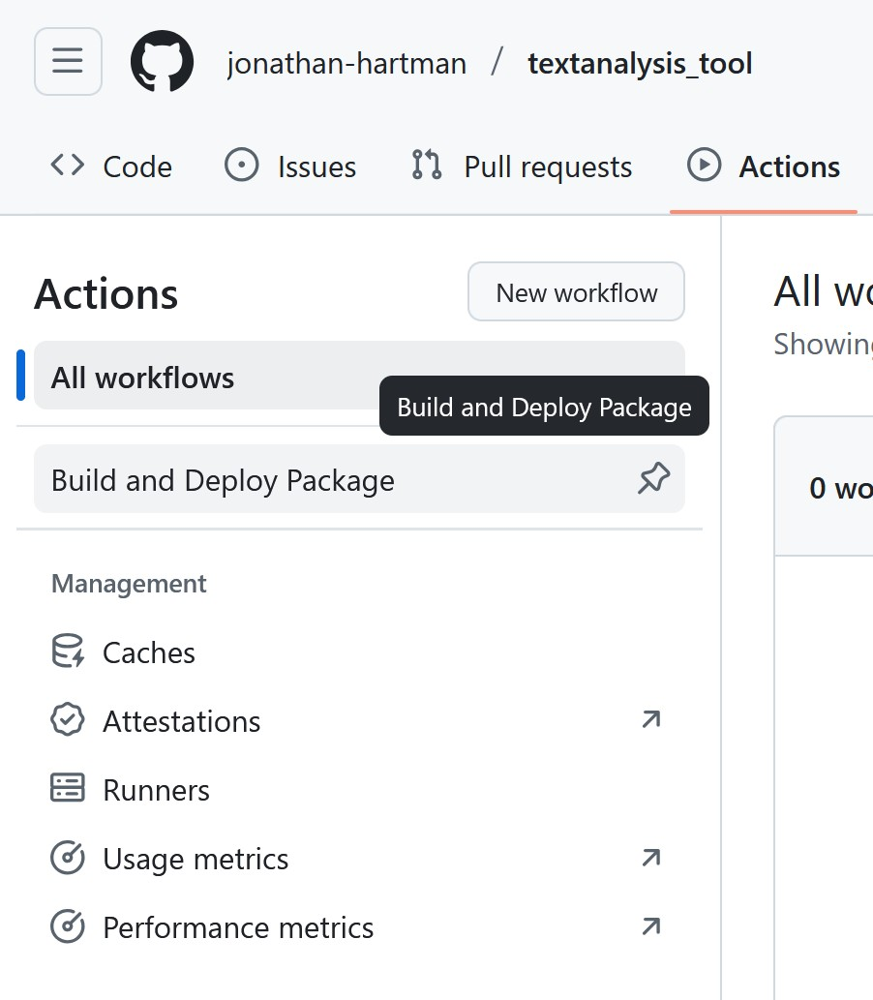
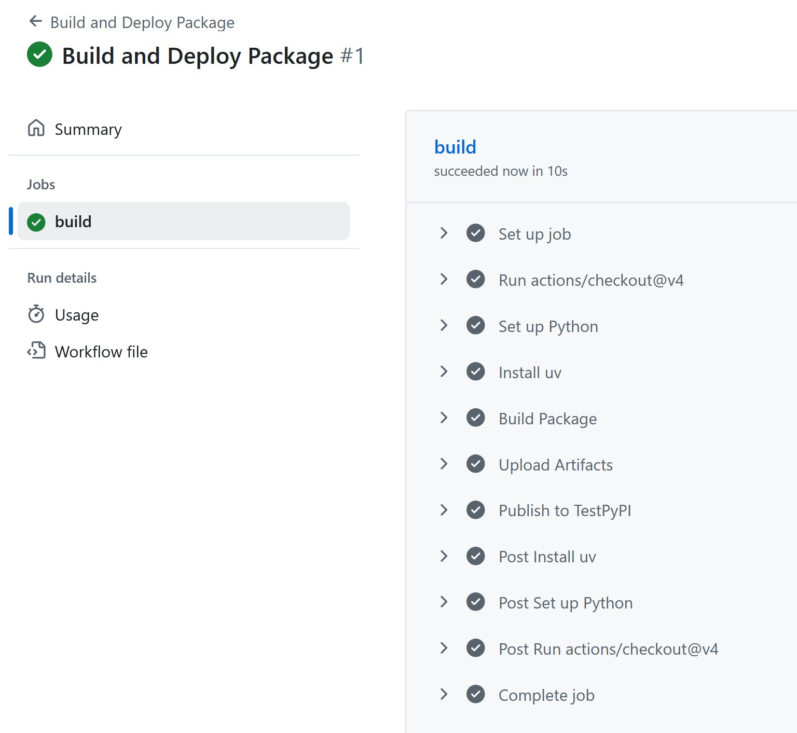

:::::::::::::::::::::::::::::::::::::: questions

- How do we build and deploy our project as a package?

::::::::::::::::::::::::::::::::::::::::::::::::

::::::::::::::::::::::::::::::::::::: objectives

- Deploy our project locally as a python package
- Set up Github Actions to automatically build and deploy our package

::::::::::::::::::::::::::::::::::::::::::::::::

## Building Locally

Since we have been using `uv` all along and have our `pyproject.toml` set up, building our package
is as simple as running:

```bash
uv build
```

You should see some output that looks like this:

```
Building source distribution...
Building wheel from source distribution...
Successfully built dist\textanalysis_tool-0.1.0.tar.gz
Successfully built dist\textanalysis_tool-0.1.0-py3-none-any.whl
```

And a new directory called `dist/` should appear in your project folder. Inside that directory,
you should see two files:

- `textanalysis_tool-0.1.0-py3-none-any.whl`: This is the wheel file, which is a built package
   that can be installed.
- `textanalysis_tool-0.1.0.tar.gz`: This is the source distribution, which contains the source code
   of your package.

### What Exactly are these files?

A Wheel file is a built package that can be installed using pip. It contains all the necessary files
for your package to run, including compiled code if applicable. Wheels are the preferred format for
Python packages because they are faster to install and can include pre-compiled binaries.

::: callout

Why is it called a "wheel"?

The term "wheel" is used because the original name for PyPi was "cheese shop" (a reference to a
Monty Python sketch), and a wheel of cheese is a common image associated with cheese shops.

:::

The source distribution is a tarball that contains the source code of your package. You can open it
with a tool like `tar` or `7-Zip` to see the contents. It includes all the files needed to build
and install your package, including the `pyproject.toml` file and any other source files.

## GitHub Actions

Building the package locally is great for testing, but what we actually want is to have our package
built and automatically deployed from GitHub, so that anyone using our package can always get the
latest version. GitHub Actions is a tool that allows us to automate tasks in our GitHub repository
by configuring a workflow using a YAML file.

### Setting Up the Workflow

In your project, create a new directory called `.github/workflows/`. Inside that directory, create
a new file called `build.yml`. This file will contain the configuration for our GitHub Actions
workflow.

Here is the ``build.yml`` file we will use:

```yaml
name: Build and Deploy Package

on:
  push:
    tags:
      - '[0-9]+.[0-9]+.[0-9]+*' # Deploy when we tag with a semantic version

jobs:
  build:
    runs-on: ubuntu-latest # Use the most up-to-date Ubuntu runner
    permissions:
      contents: write  # Required to create releases

    steps:
    - uses: actions/checkout@v4 # Check out the repository

    # Create a Python environment
    - name: Set up Python
      uses: actions/setup-python@v4
      with:
        python-version: '3.11'

    # Install uv
    - name: Install uv
      uses: astral-sh/setup-uv@v3

    # Build the package
    - name: Build Package
      run: uv build

    # Upload the built package to the repository as an artifact
    - name: Upload Artifacts
      uses: actions/upload-artifact@v4
      with:
        name: textanalysis-tool
        path: dist/

    # Create GitHub Release with artifacts
    - name: Create Release
      uses: softprops/action-gh-release@v1
      with:
        files: dist/*
        generate_release_notes: true
      env:
        GITHUB_TOKEN: ${{ secrets.GITHUB_TOKEN }}

    # Publish to TestPyPI
    - name: Publish to TestPyPI
      run: |
        uv publish --publish-url https://test.pypi.org/legacy/ --username __token__ --password ${{ secrets.TEST_PYPI_API_TOKEN }}
```

### Setting up PyPI

Because we are not ready to publish our package to the main PyPI repository, we will use TestPyPI,
which is a separate instance of the Python Package Index that allows you to test package publishing
and installation without affecting the real PyPI.

For this you will need to have an account on TestPyPI with 2-Factor enabled. You can create an
account at https://test.pypi.org/account/register/.

Once your account is set up, go to your account settings and create an API token with the name
`github-actions`. Copy the token to your clipboard.

Next, we need to store the token in our GitHub repository as a secret. Go to your repository on
GitHub, click on "Settings", then "Secrets and variables", and then "Actions". Click on
"New repository secret" and name it `TEST_PYPI_API_TOKEN`. Paste your token into the "Value" field
and click "Add secret".

### Triggering the Workflow

`git add`, `git commit`, and `git push` this file to your repository. You should see a new "Actions"
tab in your GitHub repository. Click on it, and you should see your workflow listed there:

{alt='GitHub Actions Tab with a Workflow'}

But nothing has run yet! This is because we have configured our workflow to only run when we push a
tag that follows a semantic version format (0.1.0, 1.0.0, etc.). This is a common practice for
deploying packages, as it allows us to control when a new version of our package is released.

Let's create a new tag and push it to our repository. You can do this using the following commands:

```bash
git tag 0.1.0
git push --tags
```

Looking back at the "Actions" tab, you should see that your workflow has started running! Our
project is pretty small, so it should finish quickly. Clicking on the workflow will show you the
steps that were executed:

{alt='GitHub Actions Successful Build'}

You can see the "Setup Python", "Install uv", "Build Package", and "Upload Artifacts" steps that we
defined in our `build.yml` file, as well as some additional steps before and after that GitHub
automatically adds. If everything went well, you should see a green check mark next to each step.

Clicking on any given job will give some additional details, including the console output.

::: callout

Github Actions is free for public repositories, but does have limits on the amount of compute time
you can use per month. As of September 2025, the limit is 2,000 minutes per month. This is
generally more than enough for most open source projects.

:::

### Finding the Built Package

So our workflow is successful, but where is our package? Our little script actually put our project
in three places:

- As an artifact in our GitHub repository for this workflow run
- As a release in our GitHub repository
- On TestPyPI as a package

The Artifact can be found in the "Actions" tab, by clicking on the workflow run, and then clicking
on the "Artifacts" section on the right side of the page. You can download the artifact as a ZIP
file, which contains the `dist/` directory with our built package files. (This is identical to what
we built locally earlier.)

The Release can be found by clicking on the "Releases" link on the right side of your GitHub
repository page. You should see a new release with the tag `0.1.0`, and the built package files
attached as assets.

Finally, the package can be found on TestPyPI by going to https://test.pypi.org/project/textanalysis-tool-{my-name}/.

## Installing our package from TestPyPI

Now that our package is published on TestPyPI, we can install it into any Python environment using
a package manager.  Because we are using test.pypi.org, we need to specify the index URL when
installing the package, which we do not have to do for packages on the main PyPI repository.

Create a new virtual environment in a clean folder with uv:

```bash
uv init
uv venv
uv activate
```

Then install our package from TestPyPI using pip:

```bash
uv pip install --index-url https://test.pypi.org/simple/ textanalysis-tool-{my-name}
```

You should see output indicating that pip is downloading and installing our package. Once the
installation is complete, you can verify that the package is installed by running:

```bash
uv pip show textanalysis-tool-{my-name}
```

## Continuous Integration / Continuous Deployment (CI/CD)

One of the advantages of using an automated process like GitHub Actions is that we can also easily
add additional steps to our workflow. In previous episodes, we have added unit tests to our project,
as well as static code analysis using `ruff` and `mypy`. We can easily add these steps to our
workflow to ensure that our code is always tested and checked before it is built and deployed.

Here's the updated `build.yml` file with the additional steps:

```yaml
name: Build and Deploy Package

on:
  push:
    tags:
      - '[0-9]+.[0-9]+.[0-9]+*' # Deploy when we tag with a semantic version

jobs:
  build:
    runs-on: ubuntu-latest # Use the most up-to-date Ubuntu runner
    permissions:
      contents: write  # Required to create releases

    steps:
    - uses: actions/checkout@v4 # Check out the repository

    # Create a Python environment
    - name: Set up Python
      uses: actions/setup-python@v4
      with:
        python-version: '3.11'

    # Install uv
    - name: Install uv
      uses: astral-sh/setup-uv@v3

    # Install project with dev dependencies
    - name: Install dependencies
      run: uv sync --dev

    # Static Code Analysis with ruff
    - name: Run ruff
      run: uv run ruff check .

    # Type Checking with mypy
    - name: Run mypy
      run: uv run mypy src

    # Running Tests with pytest
    - name: Run tests
      run: uv run pytest tests

    # Build the package
    - name: Build Package
      run: uv build

    # Upload the built package to the repository as an artifact
    - name: Upload Artifacts
      uses: actions/upload-artifact@v4
      with:
        name: textanalysis-tool
        path: dist/

    # Create GitHub Release with artifacts
    - name: Create Release
      uses: softprops/action-gh-release@v1
      with:
        files: dist/*
        generate_release_notes: true
      env:
        GITHUB_TOKEN: ${{ secrets.GITHUB_TOKEN }}

    # Publish to TestPyPI
    - name: Publish to TestPyPI
      run: |
        uv publish --publish-url https://test.pypi.org/legacy/ --username __token__ --password ${{ secrets.TEST_PYPI_API_TOKEN }}
```

Update the version number in your `pyproject.toml` file to `0.2.0`, and then create a new tag and
push it to your repository:

```bash
git tag 0.2.0
git push --tags
```

Now, unless you already went through in the earlier episodes, you will likely see that the `ruff`
, `mypy`, or `pytest` steps fail. This is great! It means that we have caught issues in our code
before they made it into a release! Only once all the tests pass and the code checks are clean
will the package be built and deployed.

::: callout

Making a new tag for each release is good practice, however there are also occasions where you
might want to run some of these jobs regularly when merging in code, or on pushes to certain
branches. This is possible - there is an example of this in the [Workshop Addendum]().

:::


::::::::::::::::::::::::::::::::::::: challenge

## Challenge 1:


:::::::::::::::: solution


:::::::::::::::::::::::::
:::::::::::::::::::::::::::::::::::::::::::::::

::::::::::::::::::::::::::::::::::::: keypoints

- We can build our package locally using `uv build`, which creates a `dist/` directory with the
  built package files.
- We can use GitHub Actions to automate the building and deployment of our package.
- GitHub Actions workflows are defined using YAML files in the `.github/workflows/` directory.
- We can trigger our workflow to run on specific events, such as pushing a tag that follows
  semantic versioning.
- We can add additional steps to our workflow, such as running tests and static code analysis,
  to ensure code quality before deployment.

::::::::::::::::::::::::::::::::::::::::::::::::

