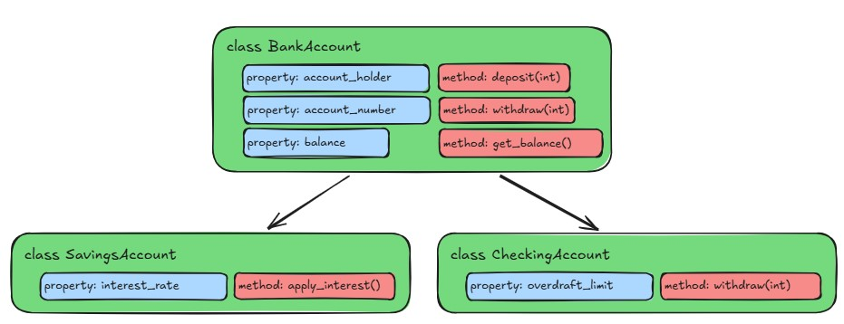

:::::::::::::::::::::::::::::::::::::: questions

- What if we want classes that are similar, but handle slightly different cases?
- How can we avoid duplicating code in our classes?

::::::::::::::::::::::::::::::::::::::::::::::::

::::::::::::::::::::::::::::::::::::: objectives

- Explain the concept of inheritance in object-oriented programming
- Demonstrate how to create a subclass that inherits from a parent class
- Show how to override methods and properties in a subclass

::::::::::::::::::::::::::::::::::::::::::::::::

## Extending Classes with Inheritance

So far you may be wondering why classes are useful. After all, all we've really done in essence is
make a tiny module with some functions in it that are slightly more complicated than normal
functions. One of the real powers of classes is the ability to limit code duplicate through a
concept called inheritance.

### Inheritance

Inheritance is a way to create a new class that contains all of the same properties and methods as
an existing class, but allows us to add additional new properties and methods, or to override
existing methods. This allows us to create a new class that is a specialized version of an existing
class, without having to rewrite a whole bunch of code.

Taking a look at our Car class from earlier, we might want to create a new class for a specific
type of bank account, like a Savings account or a Checking account. Both kinds of accounts will have
the same basic properties and methods, but they will also have some additional properties and
methods that are specific to the type of account, or properties that are set by default, like
our `interest_rate` property.

But since both types of accounts are still accounts, they will share a lot of the same properties
and methods. Rather than repeating all of the code from the Account class in both our new classes,
we can use inheritance to create our new classes based on the Account class:

In python, this would look something like this:

```python
class BankAccount:
    # Static property to keep track of the next available account number
    next_account_number = 10000

    def __init__(self, account_holder, balance = 0.0):
        self.account_holder = account_holder
        BankAccount.next_account_number += 1
        self.account_number = BankAccount.next_account_number
        self._balance = balance

    # ... the rest of the BankAccount class ...

class SavingsAccount(BankAccount):
    def __init__(self, account_holder, balance = 0.0, interest_rate = 0.01):
        super().__init__(account_holder=account_holder, balance=balance)
        self.interest_rate = interest_rate

    def apply_interest(self):
        self._balance += self._balance * self.interest_rate

class CheckingAccount(BankAccount):
    def __init__(self, account_holder, balance = 0.0, overdraft_limit = 500.0):
        super().__init__(account_holder=account_holder, balance=balance)
        self.overdraft_limit = overdraft_limit

    def withdraw(self, amount):
        if self._balance - amount < -self.overdraft_limit:
            raise ValueError("Withdrawal would exceed overdraft limit.")
        self._balance -= amount
```

{alt='Class diagram showing inheritance from BankAccount to SavingsAccount and CheckingAccount'}

::: callout

Note that the `withdraw` method in the `CheckingAccount` class is overridden to provide a different
implementation than the one in the `BankAccount` class. This is called method overriding, and it
allows us to define a different behavior for a method in a subclass. When we call the `withdraw`
method on an instance of `CheckingAccount`, it will use the overridden method, rather than the one
defined in the `BankAccount` class.

However in `SavingsAccount`, we do not override the `withdraw` method, so it will use the one
defined in the `BankAccount` class.

More on overriding methods in a moment.

:::

You can see that the SavingsAccount class is defined in a similar way to the BankAccount class, but
it inherits from the BankAccount class by including it in parentheses after the class name. The
`__init__` method of the CheckingAccount class also has a call to `super().__init__()`. The
`super()` function is a way to refer specifically to the parent class, in this case, the BankAccount
class. This allows us to call the `__init__` method of the BankAccount class, which sets up all of
the properties that a BankAccount has.

### Applying Inheritance to Our Car Class

For our `Car` class, let's create different sub classes depending on the kind of engine the car has.
We can have a `GasolineCar` class and an `ElectricCar` class that both inherit from the `Car` class.
Both these classes will share a lot of the same properties and methods, but might have some
additional properties and methods that are specific to the type of car. Let's add the following code
to our `src/vehicle_module/car.py` file:

```python
class Car:
    car_count = 0

    def __init__(self, make, model, year, color = "grey", fuel = "gasoline"):
        # ... the rest of the Car class ...

class GasolineCar(Car):
    pass # For now, a GasolineCar is just a Car, so we don't need to add any additional properties or methods

class ElectricCar(Car):
    def __init__(self, make, model, year, color = "grey", fuel = "electricity"):
        super().__init__(make=make, model=model, year=year, color=color, fuel=fuel)

    def make_engine_noise(self):
        return "hmmmmmm"
```

::: callout

Couldn't you do something like this?

```python
class ElectricCar(Car):
    def __init__(self, make, model, year, color = "grey"):
        super().__init__(make=make, model=model, year=year, color=color, fuel="electricity")
```

Yes, you could - however this would change the signature of the `__init__` method in the
`ElectricCar` class, which means that you would not be able to create an instance of `ElectricCar`
using the same parameters as you would for a `GasolineCar`. Anyone trying to use the `ElectricCar`
class would have to know that it specifically has a slightly different `__init__` method than the
other cars.

This is not necessarily a bad thing, but it can lead to confusion if you have a lot of different
subclasses that all have different `__init__` methods. By keeping the same signature for the
`__init__` method, we can ensure that all of our car classes can be instantiated in the same way,
which makes it easier to use them interchangeably.

:::

### Overriding Methods

Notice that in the `ElectricCar` class, we have overridden the `make_engine_noise` method to provide
a different implementation. This is an example of how we can override methods and
properties in a subclass to provide specialized behavior. When we create an instance of
`ElectricCar`, it will use the `make_engine_noise` method defined in the `ElectricCar` class,
rather than the one defined in the `Car` class.

::: callout

When overriding methods, it's important to ensure that the new method has the same signature as
the method being overridden. This means that the new method should have the same name, number of
parameters, and return type as the method being overridden.

:::

### Testing our Inherited Classes

Now let's try out our classes in our little test file. Let's update our `tests/car_class_tests.py`
file to test our new `GasolineCar` and `ElectricCar` classes:

```python
import sys

sys.path.insert(0, "./src")

from vehicle_module.car import Car, ElectricCar, GasolineCar

total_tests = 6
passed_tests = 0
failed_tests = 0

# ... existing tests for Car class ...

# Test creating a GasolineCar
gas_car = GasolineCar(make="Toyota", model="Camry", year=1996, color="Maroon")
if gas_car.fuel == "gasoline":
    passed_tests += 1
else:
    failed_tests += 1

# Test creating an ElectricCar
electric_car = ElectricCar(make="Skoda", model="Elroq", year=2024, color="White")
if electric_car.fuel == "electricity":
    passed_tests += 1
else:
    failed_tests += 1

# Test the make_engine_noise method of ElectricCar
if electric_car.make_engine_noise() == "hmmmmmm":
    passed_tests += 1
else:
    failed_tests += 1

```

You should get some output that looks like this:

```
Total tests: 6
Passed tests: 6
Failed tests: 0
```

### Abstract Base Classes

If we're thinking about this from the context of a game, there's actually maybe a level of less
specificity that is below even the `Car` class, which is just a general `Vehicle` class. Cars are
going to have a lot of the things we defined so far, but some of the elements are maybe more
general to all vehicles. We could create a `Vehicle` class that has all of the properties and
methods that are common to all vehicles, and then have the `Car` class inherit from the `Vehicle`
class. This way, we can have a more general class that defines the basic properties and methods.

This is a great use case for something called an "abstract base class". An abstract base class is a
class that is meant to be inherited from, but is not meant to be instantiated on its own. It can
define abstract methods, which are methods that are declared but not implemented in the abstract
base class. Subclasses that inherit from the abstract base class are then required to implement the
abstract methods, or else the construction of the subclass will fail.

Abstract base classes are implemented in Python using the `abc` module. Let's create a new file
called `src/vehicle_module/vehicle.py` and add the following code to it:

```python
from abc import ABC, abstractmethod


class Vehicle(ABC):
    car_count = 0

    def __init__(self):
        self.speed = 0
        Vehicle.car_count += 1

    @abstractmethod
    def make_engine_noise(self):
        pass

    @classmethod
    def get_car_count(cls):
        return cls.car_count
```

You can see that we've transferred some of the properties and methods from the `Car` class to the
`Vehicle` class, since they feel like they are more general to all vehicles, rather than just cars.
We have also defined an abstract method called `make_engine_noise` with the `@abstractmethod`
decorator, which means that any class that inherits from `Vehicle` will be required to implement
the `make_engine_noise` method.

Next, let's update our `Car` class to inherit from the `Vehicle` class:

```python
from datetime import datetime

from .vehicle import Vehicle

class Car(Vehicle):
    # car_count = 0 # We can remove this line since the car_count property is now defined in the Vehicle class

    def __init__(self, make, model, year, color = "grey", fuel = "gasoline"):
        super().__init__() # Add a call to "super().__init__()" to call the __init__ method of the Vehicle class
        self.make = make
        self.model = model
        self.year = year
        self.color = color
        self.fuel = fuel
        # self.speed = 0 # we can remove this line since the speed property is now defined in the Vehicle class

    def honk_horn(self):
        return "Honk! Honk!"

    def paint(self, new_color):
        self.color = new_color

    def make_engine_noise(self):
        if self.speed <= 10:
            return "putt putt"
        else:
            return "vroom!"

    def __str__(self):
        return f"A {self.color} {self.year} {self.make} {self.model} that runs on {self.fuel}."

    @property
    def age(self):
        current_year = datetime.now().year
        return current_year - self.year

    # This entire method is now inherited from the Vehicle class, so we can remove it from the Car class
    # @classmethod
    # def get_car_count(cls):
    #     return cls.car_count
```

Let's run our tests again to make sure everything is still working:

```
$ uv run tests/car_class_test.py
Total tests: 6
Passed tests: 6
Failed tests: 0
```

Looks good! We've got a firm base to build on now!


::::::::::::::::::::::::::::::::::::: challenge

## Challenge 1: Predict the output

What will happen when we run the following code? Why?

```python
class Animal:
    def __init__(self, name):
        print(f"Creating an animal named {name}")
        self.name = name

    def whoami(self):
        return f"I am a {type(self)} named {self.name}"

class Dog(Animal):
    def __init__(self, name):
        print(f"Creating a dog named {name}")
        super().__init__(name=name)

class Cat(Animal):
    def __init__(self, name):
        print(f"Creating a cat named {name}")


animals = [Dog(name="Chance"), Cat(name="Sassy"), Dog(name="Shadow")]

for animal in animals:
    print(animal.whoami())

```

:::::::::::::::: solution

We get some of the output we expect, but we also get an error:

```
Creating a dog named Chance
Creating an animal named Chance
Creating a cat named Sassy
Creating a dog named Shadow
Creating an animal named Shadow
I am a <class '__main__.Dog'> named Chance

---------------------------------------------------------------------------
AttributeError                            Traceback (most recent call last)
Cell In[4], line 22
     19 animals = [Dog(name="Chance"), Cat(name="Sassy"), Dog(name="Shadow")]
     21 for animal in animals:
---> 22     print(animal.whoami())

Cell In[4], line 7, in Animal.whoami(self)
      6 def whoami(self) -> str:
----> 7     return f"I am a {type(self)} named {self.name}"

AttributeError: 'Cat' object has no attribute 'name'
```

We failed to call the `super().__init__()` method in the `Cat` class, so the `name` property was
never set. When we then try to access the instance property `name` in the `whoami` method, we get an
`AttributeError`.

:::::::::::::::::::::::::

:::::::::::::::::::::::::::::::::::::::::::::::

::::::::::::::::::::::::::::::::::::: challenge

## Challenge 2: Class Methods and Properties

We've mostly focused on instance properties and methods so far, but classes can also have what are
called "class properties" and "class methods". These are properties and methods that are associated
with the class itself, rather than with an instance of the class.

Without running it, what do you think the following code will do? Will it run without error?

```python
class Animal:
    PHYLUM = "Chordata"

    def __init__(self, name):
        self.name = name

    def whoami(self):
        return f"I am a {type(self)} named {self.name} in the phylum {self.PHYLUM}"

class Snail(Animal):
    def __init__(self, name):
        super().__init__(name=name)

animal1 = Snail(name="Gary")
Animal.PHYLUM = "Mollusca"
print(animal1.whoami())

animal2 = Snail(name="Slurms MacKenzie")
print(animal2.whoami())

creature3 = Snail(name="Turbo")
creature3.CLASS = "Gastropoda"
print(creature3.whoami(), "and is in class", creature3.CLASS)
```

::: hint

The `PHYLUM` property is a class property, so it is shared among all instances of the class.

:::

:::::::::::::::: solution

There's two things about this piece of code that are a bit tricky.

1 The `PHYLUM` property is a class property, so it is shared among all instances of the class.
When we set `Animal.PHYLUM = "Mollusca"`, we are actually modifying the class property for all
instances going forward, which is why when we print `animal2.whoami()`, it shows that the phylum
is still "Mollusca", even though we created a new instance of `Snail`.

2 - We never defined a `CLASS` property in the `Animal` or `Snail` class, but we can actually still
create a new property on an instance of a class at any time. (Generally, this is not a good idea,
as it can cause confusion when you reference a property that doesn't exist in any class definition,
but it is technically possible.)

:::::::::::::::::::::::::

:::::::::::::::::::::::::::::::::::::::::::::::

::::::::::::::::::::::::::::::::::::: challenge

## Challenge 3: Create a new subclass

The previous challenge is not quite correct, as canonnically "Slurms MacKenzie" is not a snail, but
a slug. Create a subclass of 'Animal' called "Mollusk" that inherits from "Animal", but only sets
the class property `PHYLUM` to "Mollusca". Then create two subclasses of "Mollusk": "Snail" and
"Slug".

You can implement any methods or properties you want in the "Snail" and "Slug" classes, but you
may also just leave them empty like so:

```python
class MyClass:
    pass
```

::: hint

It is not necessary for the `Snail` and `Slug` classes to have their own `__init__` methods, as they
will inherit the `__init__` method from the `Animal` class through the `Mollusk` class.

:::


:::::::::::::::: solution

```python
class Animal:
    PHYLUM = "Chordata"

    def __init__(self, name):
        self.name = name

    def whoami(self):
        return f"I am a {type(self)} named {self.name} in the phylum {self.PHYLUM}"

class Mollusk(Animal):
    PHYLUM = "Mollusca"

class Snail(Mollusk):
    pass

class Slug(Mollusk):
    pass
```

:::::::::::::::::::::::::

:::::::::::::::::::::::::::::::::::::::::::::::


::::::::::::::::::::::::::::::::::::: keypoints

- Inheritance allows us to create a new class that is a specialized version of an existing class
- We can override methods and properties in a subclass to provide specialized behavior

::::::::::::::::::::::::::::::::::::::::::::::::

