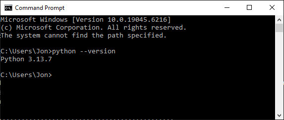

## Software Setup - Python

This workshop relies on an installation of python on your device. You will need to have at least
python version 3.9 or later for the project that we will create here.

If you do not already have python installed on the device you are bringing to the workshop, you can
go to the [python.org downloads page](https://www.python.org/downloads/) and download the most
recent version.

::: tab

### Windows

You can check the version of python you have installed by opening up a new command line / terminal
and typing `python --version`:

{alt='Viewing the python version in the command line'}

### Mac

TBD

### Linux

TBD

:::

## Software Setup - UV

We will also be working with the UV package management tool. You can follow the install
instructions found [on the project website](https://docs.astral.sh/uv/getting-started/installation/).

## Software Setup - git and GitHub (Optional)

::: callout

We will be demonstrating the use of GitHub during the workshop, however if you would prefer not to
use the service it is not required to have an account in order to participate in the workshop.

:::

We will be using git and GitHub to manage our code during the workshop. If you do not already have
a GitHub account, you can create one for free at [github.com](https://github.com/).

Once you have an account, you will need to authorize git on your device to push code to your GitHub
account. If you are familiar with SSH keys, you can use those. If not, you can use a personal
access token (PAT).

### Creating a Personal Access Token

Once you are logged into GitHub, click on your profile icon in the upper right corner of the
screen, and select "Settings" from the dropdown menu. On the left side of the screen, select
"Developer settings", then "Personal access tokens", and finally "Fine-grained tokens".

Select "Generate new token", then "Generate new token" again on the next screen. You will be
prompted to give your token a name, description and expiration date. Under "Repository access",
select "All repositories". Click the "Add Permissions" button and select "Contents" and "Commit
Statuses". Update the dropdown for each to "Read and write". Finally, click the "Generate token"
button at the bottom of the page.

Your token is only ever shown once, so be sure to either copy it to your clipboard or leave the
window open while you complete the next step.

### Authorizing git to use your Personal Access Token

On your device, open a command line / terminal window. You will need to configure git to use your
PAT when pushing code to GitHub. You can do this by running the following commands:

```bash
git config --global credential.helper store
```

Then, run the following command, replacing `your-username` with your GitHub username:

```bash
git clone https://github.com/your-username/your-repo.git
```

You will be prompted for your GitHub username and password. For the password, paste in the PAT you
created in the previous step. Your credentials will be stored on your device, and you should not
have to enter them again.


## Account Setup - TestPyPi (Optional)

We will be using TestPyPi to publish our package during the workshop. You will need to create an
account on TestPyPi if you do not already have one. You can do that at
[test.pypi.org](https://test.pypi.org/account/register/).
